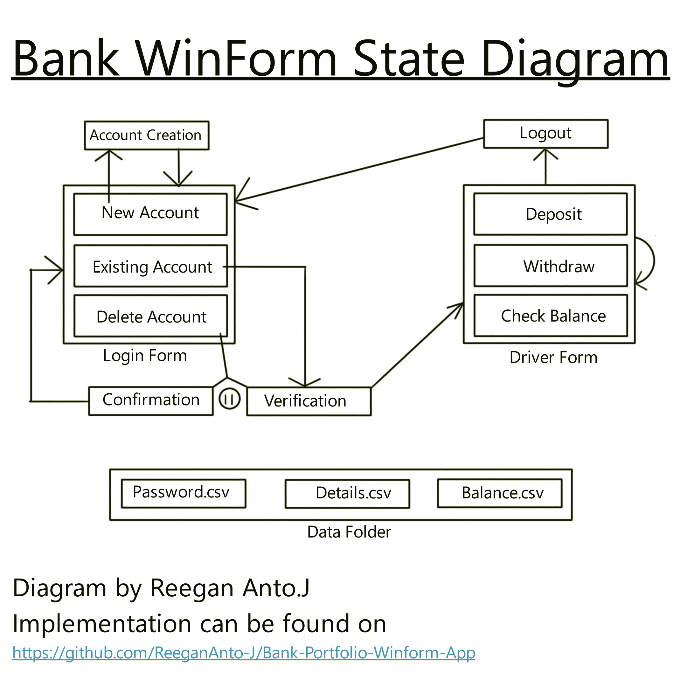

# Bank system based CRUD application
## Portfolio micro-project by Reegan Anto.J

#### Introduction:
This is a simple CRUD application which is build using WinForms. I have also implemented many necessary constraints within this program such that it handles most possible user errors on its own.

I made this project in order to express my skills in C# programming language and the underlying .NET framework.

Most of the program is written by myself hence I wouldn't consider this program to be anywhere close to be perfect or optimized; but in all honesty I recieved some help from Stack Overflow and GPT 3.5 for some file handling and basics of WinForms. This is my first ever winform application so don't expect this to be anywhere close to good.

I am a third year student in the Artificial Intelligence and Data Science department of Adhi College of Engineering and Technology and would appreciate any help you could provide me which could potentially improve my skills.

#### Key skills I applied (In my humble opinion):
- Applying OOPs concept using C#
- File Handling
- Normalization and Specialization of data and files
- Exception handling
- Effecient state transwer
- Dynamic data handling from different files
- Basics of WinForms
- Using debugging tools offered by Visual Studio
- Problem solving

Below I will explain the program step by step.

# State Diagram:

